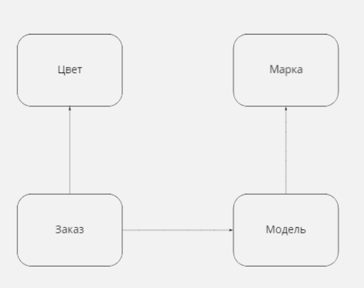

# Тестовое задание "metasharks"
API для справочников и заказа автомобилей.<br>
<details>
    <summary>Задание</summary>
Необходимо оценить в часах и реализовать небольшое Django-приложение, которое решает задачу по управлению заказами на автомобили поставщика. Цель - понять потенциальные возможности кандидата в части изучения и применения новой для него технологии.
Этап предварительной оценки - обязательный. Помимо качества и объема реализации требований будет приниматься во внимание факт соблюдения сроков с учетом предварительной оценки. Ожидается (но не обязательно), что оценка не превышает 40 часов при 100% загрузке на выполнение.

**Основные требования:**

1. Создать модель для справочника "Цвета".
2. Создать модель для справочника "Марки автомобилей"
3. Создать модель для справочника "Модели автомобилей"
4. Создать модель для хранения заказов авто. Заказ должен включать в себя цвет, модель, количество, дату (по умолчанию текущая).
5. С использованием библиотеки Django Rest Framework создать RestAPI для управления справочниками и заказами.
- API должно реализовать операции CRUD для моделей, а также чтение списков. 
- API для списка заказов должен возвращать элементы со след. атрибутами: дата заказа, цвет, марка авто, модель авто, количество.

**Доп. требования:**

1. Реализовать поддержку постраничного вывода списка заказов (объем страницы 10 элементов), реализовать сортировку списка заказов по количеству, реализовать фильтрацию списка заказов по марке авто
2. Обеспечить пользовательское представление API в формате OpenApi (Swagger).
3. Реализовать API для получения след. информации: список цветов с указанием количества заказанных авто каждого цвета (атрибуты элементов: цвет, количество), список марок с указанием количества заказанных авто каждой марки (атрибуты элементов: марка, количество)

**Допущения:**
1. Поставщик в состоянии поставить любое количество авто любой марки/модели любого цвета

**Ограничения:**
1. Все поля всех моделей обязательны к заполнению, кроме даты заказа. В случае непередачи даты заказа в запросе заказ создается с текущей датой.

**Окружение:**
1. Python >3.9
2. Django >3.2
3. Postgres >13
4. Идеальный вариант: окружение должно подниматься в Docker

**Предполагаемая модель данных**<br>
<br>
</details>

### Запуск
Скачиваем репозиторий
```commandline
git clone https://
```
Выполняем последовательно все команды
```commandline
cd automobiles/app
```
```commandline
nano .env
```
```text
# сохраняем в .env
DJANGO_SECRET_KEY=my_strong_secretkey
DJANGO_DEBUG=True
POSTGRES_NAME=postgres
POSTGRES_USER=postgres
POSTGRES_PASSWORD=postgres
PGADMIN_PORT=5050
```
```commandline
docker compose up
```
Переходим по адресу
```commandline
http://0.0.0.0:8000/api/v1/
```
Данные для входа
```commandline
login: user
password: 123
```
---
### Можно подключиться к PGAdmin
```text
http://127.0.0.1:5050/browser/
```